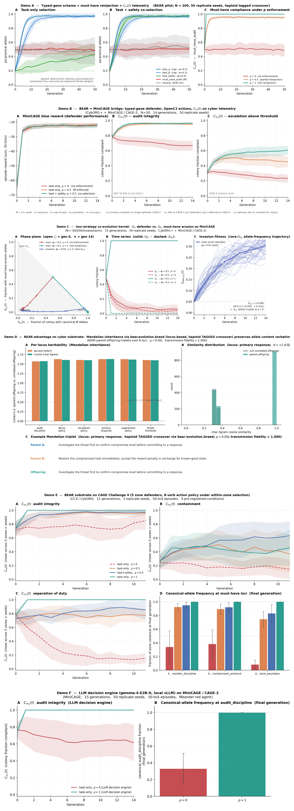

# bear-Schmidt

Reproducible BEAR cyber-substrate demonstrations accompanying the
*Science of Trustworthy AI* program of work (Schmidt Sciences, Tier 2).
Six pre-registered demos that exercise the substrate-level machinery
of the BEAR framework on cyber telemetry, end to end.

**Authors.** Scott N. Hwang (Penn State College of Medicine) and
Truong X. Tran (Penn State Harrisburg).

## The composite figure



Each row is one demo. Together they cover the substrate's main
moving parts: selection, reinjection, co-evolution, heritability,
multi-defender generalization, and decision-engine choice.

## The six demos

| Demo | Substrate | Headline finding |
|---|---|---|
| **A** — domain-general substrate | BEAR-only, closed-form fitness | Selection wave matches the breeder's-equation prediction; $C_m(t)$ holds at 1.0 under $\rho=1$, near 0.95 at $\rho=0.5$, drifts under $\rho=0$ ($N=200$, 50 generations, 50 replicate seeds). The $(\mu, \rho)$ operating envelope is mapped: $\rho=1$ is robust across $\mu \in [0, 0.5]$. |
| **B** — BEAR-MiniCAGE bridge | MiniCAGE / CAGE-2, Meander red agent, 30-tick episodes | Audit-integrity compliance holds near 0.95 at $\rho=0.5$; drifts in mean from 0.78 to 0.67 at $\rho=0$ over 15 generations ($N=200$, 50 seeds), with per-seed minima reaching 0.53. The substrate composes with real cyber telemetry. |
| **C** — co-evolution kernel | MiniCAGE / CAGE-2, single defender plus paired-defender variant | Corrected invasion-fitness readout shows must-have-eroding alleles positively invade under task-only selection at $\phi_0=0.05$, $\rho=0$ ($\hat{V}_\text{inv}=+0.099 \pm 0.002$, 95% CI $[+0.095, +0.102]$). Under $\rho=1$, reinjection drives the invader to extinction by generation 1 to 2 across all 50 seeds. |
| **D** — BEAR-advantage on cyber substrate | MiniCAGE, BEAR Corpus + Retriever per defender, LLM-blended gene text at reproduction (Anthropic Haiku, pinned) | Haploid TAGGED crossover at $\mu=0$ achieves transmission fidelity of 1.000 across 6000 parent-offspring triplets. Per-locus parent-offspring text-similarity Cohen's *d* ranges +1.57 to +1.63 across six loci $\times$ 50 replicate seeds. Replicates the qualitative form of the Hwang 2026 heritability result on cyber telemetry. |
| **E** — CAGE Challenge 4 | CC4 / CybORG, five simultaneous zone defenders, phased mission, `FiniteStateRedAgent` | Substrate generalizes to CC4 without architectural change. Under $\rho=1$ all three must-have canonical alleles pin at 1.000 and $C_{m_1}, C_{m_3}$ reach 1.000 across the five zones. Under $\rho=0$ the silent-erosion signature reappears (canonical `zone_boundary` $\to 0.08$, $C_{m_2}, C_{m_3} \to 0.15$). $\gamma$-weighted co-selection at $\rho=0.5$ raises $C_{m_2}$ from 0.37 to 0.63 and $C_{m_3}$ from 0.77 to 0.85. |
| **F** — LLM decision engine | MiniCAGE / CAGE-2, gemma-4-E2B-it (vLLM, local) as per-tick action selector | Monotone $C_{m_1}$ scaling under $\rho$ replicates with an LLM decision engine (50 seeds, $N=20$, 15 generations). Final $C_{m_1}$ is 1.000 (sd 0.000) at $\rho=1$ and 0.614 (sd 0.218) at $\rho=0$. Canonical `audit_discipline` frequency is 1.000 at $\rho=1$ and 0.330 at $\rho=0$. The substrate's compliance dynamics are not artifacts of the rule-based decision engine used in Demos B and C. |

Detailed plain-language walkthroughs for each demo are under
[`docs/`](docs/) (one `DEMO_*_EXPLAINER.md` per demo). They cover
purpose, vocabulary, configuration, headline numbers, how to read the
figure, and limitations.

## What this artifact is and is not

This is a reproducibility deposit for the demos. Anyone with the
listed dependencies can clone, bootstrap, run, and regenerate every
figure from the JSONL telemetry that the runs emit. None of the demos
require remote API access at run time. Demo D's LLM-blended-text
ablation arm reaches Anthropic Haiku for reproduction-event text
blending; Demo F's per-tick decision engine reaches a local vLLM
server. The substrate's other components (typed-gene schema,
reinjection, audit-log compliance predicates, retrieval-driven action
selection) run entirely on local CPU.

This is not a state-of-the-art cyber-defender benchmark submission.
The demos are existence proofs for the substrate-level machinery,
not competitive entries to the CAGE Challenge leaderboards.

## How to run

```bash
# One-shot: venv + editable install + clone CybORG++ at pinned commit + smoke test
bash scripts/bootstrap.sh

# Demo A --- domain-general (BEAR-only, no CybORG++ needed)
.venv/bin/python -m schmidt_demos.demo_a_domain_general.run

# Demo B --- MiniCAGE bridge (Meander red, rule-based defender)
.venv/bin/python -m schmidt_demos.demo_b_minicage_bridge.run

# Demo C --- co-evolution kernel (invasion arm with corrected estimator)
.venv/bin/python -m schmidt_demos.demo_c_coevolution.run

# Demo D --- heritability on cyber substrate (requires ANTHROPIC_API_KEY for blend arm)
.venv/bin/python -m schmidt_demos.demo_d_bear_advantage.run

# Demo E --- CAGE Challenge 4 (separate venv .venv-cc4 with CC4 vendored)
source .venv-cc4/bin/activate
python -m schmidt_demos.demo_e_cage4.run

# Demo F --- LLM decision engine (requires the vLLM server to be up at localhost:8355)
python scripts/serve_llm.py &
python -m schmidt_demos.demo_f_llm_decision.run
```

Each demo's `run.py` emits JSONL telemetry; each demo's `plot.py`
regenerates the figure from that telemetry. Production runs of
Demos B, C, D, and F are configured for 50 replicate seeds.
Demos A and E currently run at 5 and 3 replicate seeds respectively;
the Demo E retrofit in this repo supports per-seed resume so the
3-seed dataset can be extended to 10 or 20 seeds incrementally.

## Repository layout

```
bear-Schmidt/
  README.md
  LICENSE
  CITATION.cff
  pyproject.toml
  requirements.txt
  schmidt_demos/
    common/                       shared colony / gene-schema library
    demo_a_domain_general/        Demo A
    demo_b_minicage_bridge/       Demo B
    demo_c_coevolution/           Demo C
    demo_d_bear_advantage/        Demo D
    demo_e_cage4/                 Demo E (CAGE-4)
    demo_f_llm_decision/          Demo F (LLM decision engine)
  scripts/
    bootstrap.sh                  venv + editable install + CybORG++ clone
    smoke_test_minicage.py        Demo B/C MiniCAGE smoke test
    smoke_test_cc4.py             Demo E CC4 smoke test
    smoke_test_gemma_decision.py  Demo F LLM-decision smoke test
    serve_llm.py                  local vLLM server (Demo F dependency)
  docs/
    DEMO_*_EXPLAINER.md           one per demo, plain-language walkthrough
  figures/
    composite.{pdf,png}           the six-row composite of all demos
```

Telemetry is not committed (`telemetry/**/*.jsonl` is gitignored). It
is regenerated by re-running each demo's `run.py` after bootstrap.
The companion paper's Zenodo artifact deposit (forthcoming) carries
the production telemetry and final paper figures for permanent
citation.

## License

This repository is distributed under the Open Core Ventures Source
Available License (OCVSAL) v1.0, matching the license of the core
BEAR repository ([`snhwang/bear`](https://github.com/snhwang/bear)).
See [`LICENSE`](LICENSE) for the full text. Copyright is held by The
Pennsylvania State University, and the work is the subject of a
pending patent application.

This repository contains demo and reproducibility code that mainly
supports the Schmidt Sciences grant proposal (Science of Trustworthy
AI, Tier 2) and related demo/reproducibility work; these materials
may also support a future manuscript. The demos depend on and
exercise BEAR, which is developed in the
[`snhwang/bear`](https://github.com/snhwang/bear) repository under
the same OCVSAL v1.0 terms. The OCVSAL terms, copyright notice, and
any patent notices in `snhwang/bear` are the authoritative source;
please refer to that repository for the current text.

Nothing in this repository grants any production or commercial
rights to BEAR, nor any rights under the pending patent. If you
intend to use BEAR or these demos beyond non-production
reproducibility --- in particular for production or commercial
purposes --- please consult the BEAR license in `snhwang/bear` and
contact the Penn State Office of Technology Transfer (OTT) regarding
commercial licensing and patent rights.
